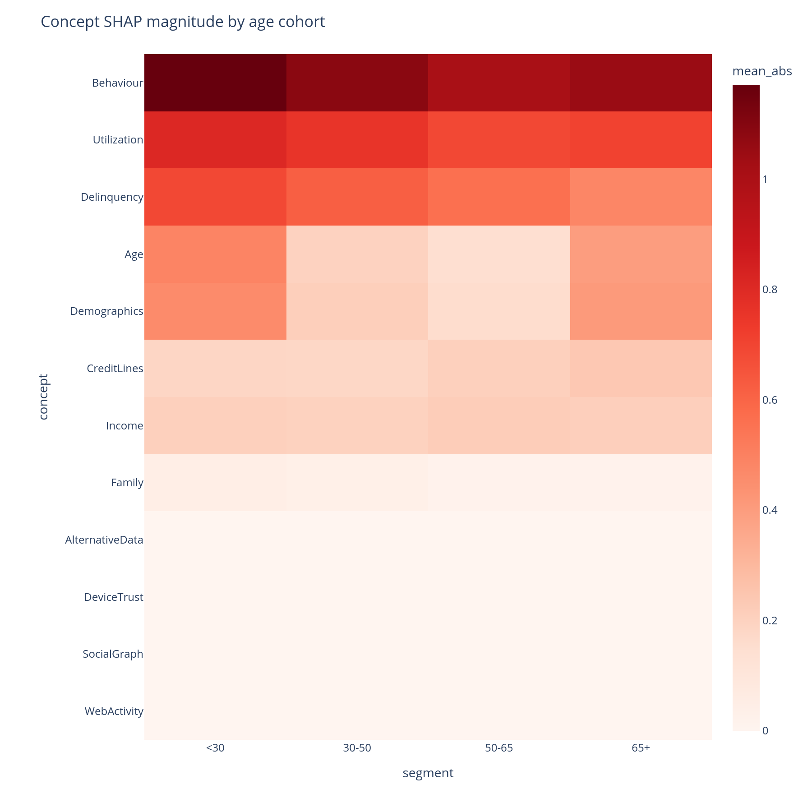
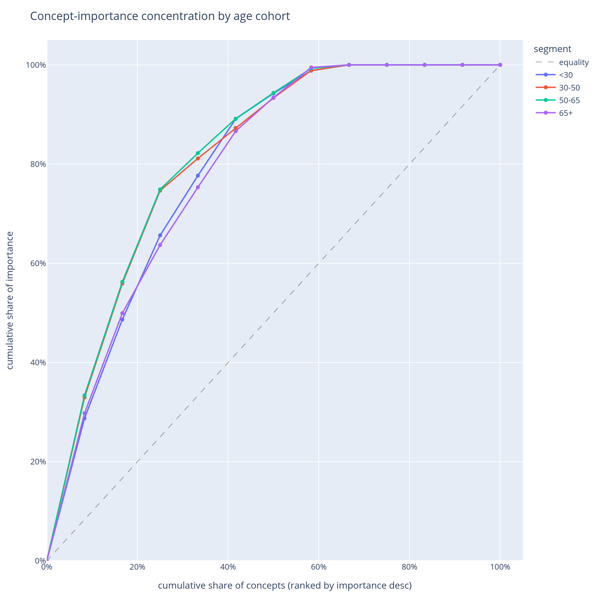

# Does importance differ across cohorts?

The model has one global behaviour described in [structure](structure.md).
Operationally, it has *several* behaviours — one per segment (age
bucket, geography, channel, vintage, …). The cohort view surfaces the
differences.

## When to use this

- When the population is not homogeneous and a single global
  importance ranking would mask sub-population behaviour.
- When investigating a quality regression in one segment to find which
  concept is driving the change.
- Before any [fairness](fairness.md) review — the cohort view is the
  legitimate-business-segment baseline against which protected-group
  disparities are interpreted.

## The two views

| Function | Returns | Use for |
|---|---|---|
| [`segment_importance`](../api.md#importance) + [`segment_concept_heatmap`](../api.md#plotting) | Long-form (concept, segment) → value | "Which concepts matter in which segments?" |
| [`segment_importance`](../api.md#importance) + [`concept_pareto`](../api.md#plotting) | Cumulative-importance curves per segment | "Is the model concentrated on a few concepts in this cohort or spread across many?" |

Both use the same `segment_importance` metric; the difference is in
the plot.

## Minimal example

```python
from concept_graph_xai import (
    concept_pareto, segment_concept_heatmap, segment_importance,
)

# Define cohorts however you like — pre-existing column, computed
# series, or a fresh categorical you derive from X.
X["age_bucket"] = pd.cut(X["age"], bins=[0, 30, 45, 60, 120],
                         labels=["<30", "30-44", "45-59", "60+"])

seg = segment_importance(graph, feature_names, shap_values,
                         segments="age_bucket", X=X)

# Heatmap — full-grid view.
segment_concept_heatmap(graph, seg).show()

# Pareto — concentration vs. spread.
concept_pareto(graph, seg).show()
```

{ width="640" }

{ width="640" }

## Reading the output

### Segment × concept heatmap

Rows are concepts (DFS preorder). Columns are segments (in the order
of the categorical's `categories`, or first-seen if the segments
column is a plain object dtype). Cell colour is mean|SHAP|
contribution of that concept in that segment.

A **row that is uniformly red** means the concept always matters.
A **row with a single dark column** means the concept matters *only*
for that segment — often the most actionable finding, because it
points at a segment-specific behaviour the global view hid.
Hover gives the per-cell value and the concept's `feature_count`.

### Pareto curves

One line per cohort. X = concept rank within cohort. Y = cumulative
share of that cohort's total |SHAP|. A **steep** curve means the
model is concentrated on a few concepts for that cohort; a **flat**
curve means it spreads its attention.

Concentration is fragility: a model that depends on three concepts
for the senior cohort is more brittle to those three concepts shifting
than a model that depends on ten. The Pareto chart is the natural
"diversification" axis for the operational-risk view.

## What to do with the answer

1. Open the heatmap on the segment that motivated the analysis (the
   regressing cohort, the new geography, the new channel) and look
   for the row whose colour profile is most different from the
   others — that is the concept the model uses differently for that
   segment.
2. Pair the Pareto curves with the
   [bootstrap importance](structure.md) intervals — a steep Pareto
   curve plus a wide CI on the top concept is the strongest
   "fragility + uncertainty" signal in the library.
3. Carry the per-segment rankings into the
   [robustness](robustness.md) ablation: a concept that is critical
   in one segment is the one to retrain-ablate first.

## Common pitfalls

- **Segment definition matters.** Buckets you compute from continuous
  features (`pd.cut`, `pd.qcut`) imply choices the heatmap will not
  visualise. Always inspect `seg["segment"].value_counts()` before
  reading anything off the heatmap — small buckets produce noisy
  mean|SHAP| estimates.
- **Categorical order.** `segment_importance` honours
  `pd.CategoricalDtype.categories` for ordered categoricals and falls
  back to first-seen otherwise. Set the order on the column *before*
  calling `segment_importance` if you want a specific column order in
  the heatmap.
- **Cohort vs protected attribute.** This page is for cohorts that
  are legitimate business segments (age, geography, channel). For
  *protected* attributes (sex, race, marital status), the
  [fairness](fairness.md) view (`concept_disparity`) is the right call
  — its disparity computation is signed and measured against an
  explicit reference group rather than a mean across cells.

## Related

- [`segment_importance`](../api.md#importance),
  [`segment_concept_heatmap`](../api.md#plotting),
  [`concept_pareto`](../api.md#plotting) — API reference.
- [Fairness](fairness.md) — the same row/column shape, different
  question.
- [How it works, Part F](../how-it-works.md#part-f-does-importance-differ-across-cohorts)
  — the same answers in narrative form.
