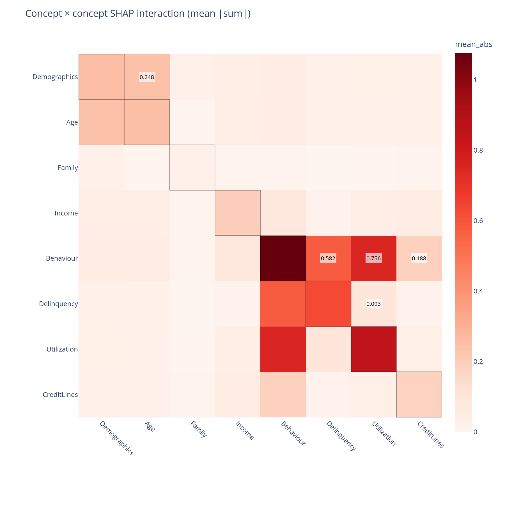
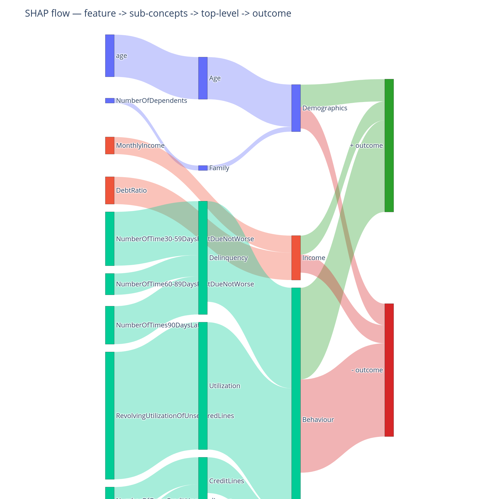

# Composition

[Structure](structure.md) answered *which concepts* the model relies
on. Composition answers *how those concepts work together* — which
pairs interact, and how does the average prediction physically flow
from raw column to decision.

## When to use this

- After identifying the top-ranked concepts in
  [Structure](structure.md), to check whether any pair has a strong
  non-additive interaction.
- When preparing the model-report figure that shows the signal flow
  end-to-end — the Sankey is the most non-technical-friendly chart in
  the library.
- When debugging an interaction-heavy model where per-feature SHAP is
  misleading because pairs of features cancel out at the leaf level
  but the pair-as-a-concept does not.

## The two views

| Function | Returns | Use for |
|---|---|---|
| [`concept_interaction_matrix`](../api.md#interaction) + [`concept_interaction_heatmap`](../api.md#plotting) | Concept × concept SHAP interaction matrix | "Do these two concepts have a non-additive signal?" |
| [`concept_sankey`](../api.md#plotting) | Multi-tier Sankey | "Where does the signal flow?" |

The interaction matrix needs a `(N, F, F)` SHAP interaction tensor —
expensive. The Sankey needs only `(N, F)` standard SHAP.

## Minimal example

```python
from concept_graph_xai import (
    concept_interaction_heatmap, concept_interaction_matrix,
    concept_sankey,
)

# Concept × concept interactions (needs interaction tensor)
inter = concept_interaction_matrix(graph, feature_names,
                                   shap_interaction_values)
concept_interaction_heatmap(inter).show()

# Feature → concept → ±outcome flow (needs standard SHAP)
concept_sankey(graph, feature_names, shap_values).show()
```

{ width="560" }

{ width="720" }

## Reading the output

### Interaction matrix

Cells aggregate per-sample SHAP interaction values up the tree:

- Diagonal cells = within-concept self-interaction. Non-zero means
  the concept's features interact with each other.
- Off-diagonal cells = between-concept interaction. Both halves are
  drawn (the matrix is symmetric) so the visual is unambiguous.

A large off-diagonal cell — *Income × Behaviour*, say — means a
univariate "what does Income contribute" answer is incomplete; the
contribution depends on behavioural context. That belongs in the
model report next to the importance ranking.

A large diagonal cell with a small off-diagonal cell means the
concept is internally non-linear but does not cross-react with other
concepts — which is exactly what the tree was set up to find.

### SHAP Sankey

Left: features. Middle: one tier per concept level, ordered
top-to-bottom in DFS preorder so siblings sit together — deep trees
produce multiple intermediate tiers (`feature → sub-concept →
top-level concept`). Right: the ±outcome bucket.

- Link **width** = summed magnitude of SHAP contribution along that
  edge.
- Link **colour** = inherits the top-level branch hue, so a single
  branch's flow is visually one stream from feature to outcome.
- Top-level concepts split their flow between `+outcome` and
  `-outcome`: the rows where the concept's summed contribution pushes
  the prediction *up* feed the `+` band, the rows where it pushes
  *down* feed the `-` band.
- Concepts are placed at explicit `(x, y)` coordinates so vertical
  order is deterministic (not the Plotly auto-arrange, which would
  re-order to minimise crossings).

## What to do with the answer

1. Pull the top-3 off-diagonal interaction cells into the model
   report under "non-additive effects".
2. Use the Sankey as the *one* figure in a non-technical deck — it
   shows the whole pipeline in one frame.
3. Cross-check with [per-prediction explanations](per-prediction.md):
   a concept with a large off-diagonal interaction will show a wide
   `concept_violin` and a context-dependent waterfall.

## Common pitfalls

- **SHAP interaction values are expensive.** `shap.TreeExplainer`
  computes them in `O(F²)` per sample. For 150k rows × 50 features
  this is minutes; for 1M × 200, this is hours. Sub-sample (`N=2000`
  is usually enough for the matrix to stabilise) or use
  [`shap.utils.sample`](https://shap.readthedocs.io/en/latest/) to
  build a representative subset.
- **Per-row Sankey misleads.** `concept_sankey` aggregates over
  all rows. For a single-row view, use the
  [concept waterfall](per-prediction.md) instead — it answers the
  same question for one prediction.

## Related

- [Per-prediction](per-prediction.md) — the same composition at the
  row level, where row-specific interactions become visible.
- [How it works, Part C](../how-it-works.md#part-c-how-does-the-signal-compose) — the
  same answers in narrative form.
