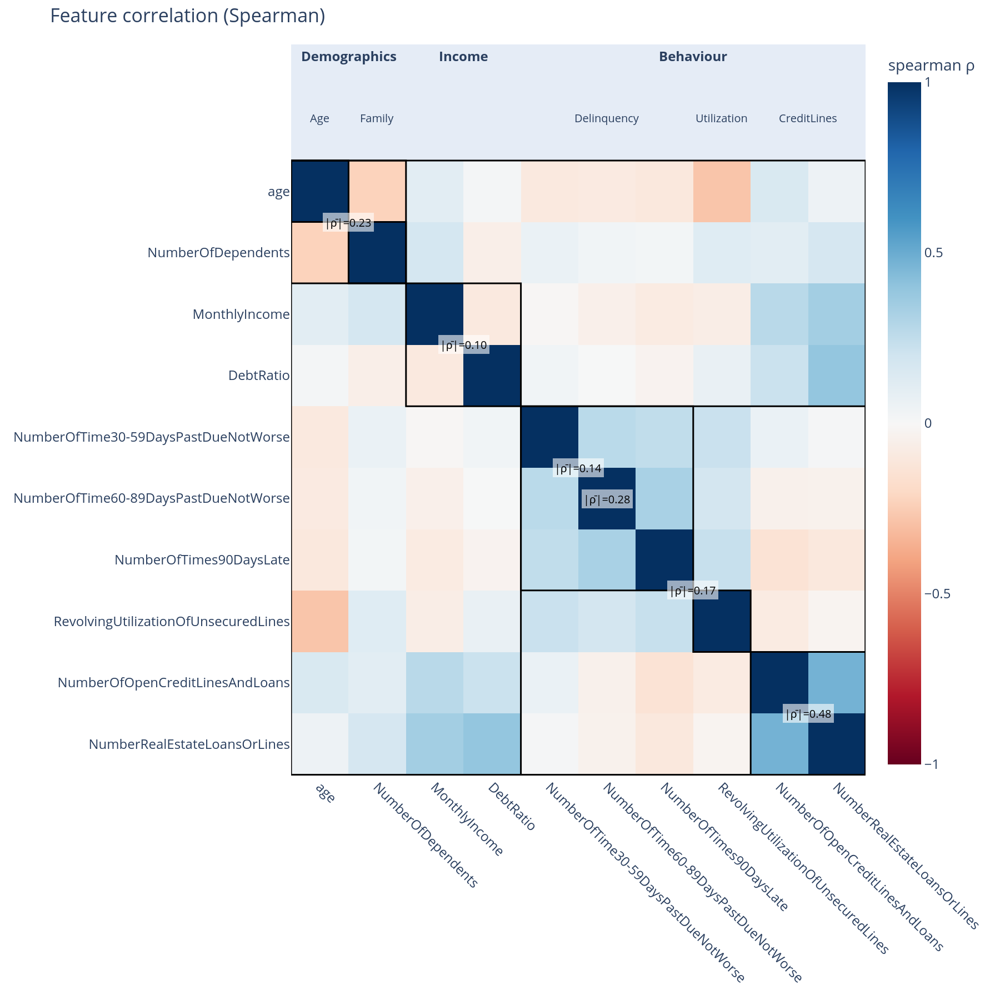
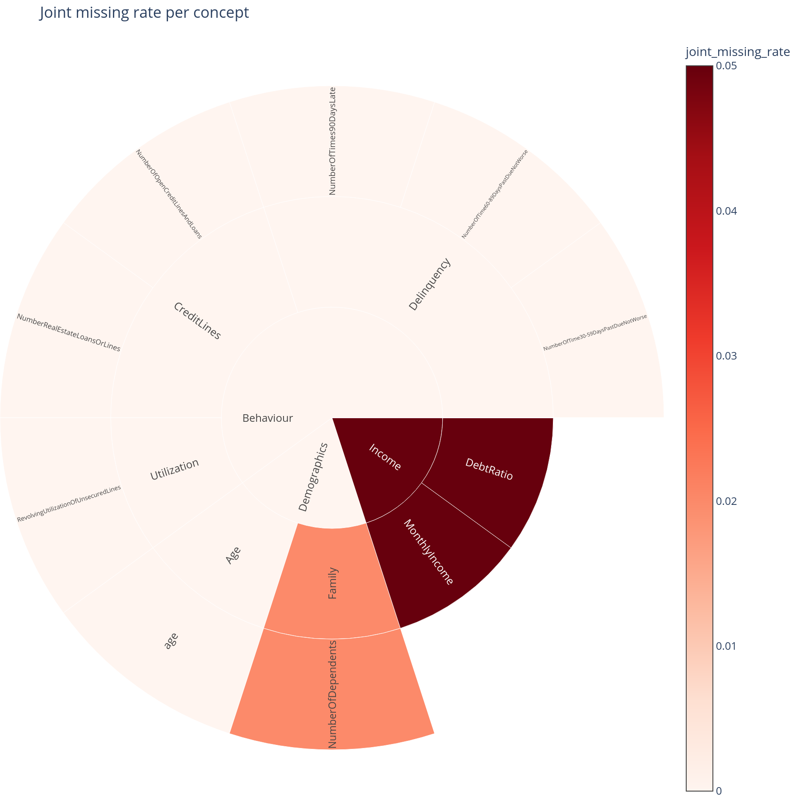

# Is my concept tree any good?

The most important question this library answers, and the one that
per-feature SHAP cannot ask at all. When someone hands you a concept
tree (or when you draw one on a whiteboard), you want to know whether
the concepts actually correspond to *clusters* in the data and to
*groups* the model treats together. The Part-E diagnostics answer
that.

## When to use this

- Immediately after building or revising a concept graph, before any
  downstream analysis.
- When the [structure](structure.md) view returns a counter-intuitive
  ranking — often the tree, not the model, is the problem.
- Before defending the tree in a tree-design review, a model-risk
  meeting, or a regulatory submission.

## The four views

| Function | Operates on | Diagnoses |
|---|---|---|
| [`feature_correlation`](../api.md#correlation) + [`correlation_block`](../api.md#plotting) | Raw `X` | Within-concept coherence; concept-boundary leakage. |
| [`nullity_correlation`](../api.md#correlation) + [`correlation_block`](../api.md#plotting) | `X.isna()` | Do features inside a concept go missing together? |
| [`shap_correlation`](../api.md#correlation) + [`correlation_block`](../api.md#plotting) | `shap_values` | Does the model treat features inside a concept as substitutes? |
| [`coherence_importance`](../api.md#coherence) + [`coherence_importance_scatter`](../api.md#plotting) | `X` + `shap_values` | The single chart: well-designed vs kitchen-sink vs redundant vs noise. |

All four return either a `CorrelationResult` (block matrix +
per-block stats) or a `DataFrame` consumed by the same family of
plots.

## Minimal example

```python
from concept_graph_xai import (
    coherence_importance, coherence_importance_scatter,
    correlation_block, feature_correlation,
    joint_missing_map, joint_missing_rate,
    nullity_correlation, shap_correlation,
)

# 1. Are the concepts coherent?
fc = feature_correlation(graph, X, method="spearman")
correlation_block(fc, title="Feature correlation").show()

# 2. Does the model treat them as such?
sc = shap_correlation(graph, feature_names, shap_values)
correlation_block(sc, title="SHAP correlation").show()

# 3. The headline diagnostic — coherence vs importance.
coh = coherence_importance(graph, X, feature_names, shap_values)
coherence_importance_scatter(coh).show()

# 4. Do whole branches go missing together?
correlation_block(nullity_correlation(graph, X),
                  title="Nullity correlation").show()
joint_missing_map(graph, joint_missing_rate(graph, X)).show()
```

{ width="640" }

{ width="640" }

{ width="520" }

## Reading the block heatmap

Features are reordered along the **graph's DFS preorder**, so every
concept's descendants form a contiguous block. The plot draws
separator lines between top-level concept blocks and annotates each
diagonal block with its mean(|ρ|).

A "good" tree under **feature correlation** typically looks like:

- dark, high-correlation diagonal blocks (within-concept coherence);
- mostly white off-diagonal blocks (concepts are different things).

Boundary leakage shows up as a high off-diagonal block — two concepts
that are more correlated with each other than with their internal
features. That is a tree-design problem, not a model problem.

When `feature_correlation` and `shap_correlation` disagree, that is
informative, not a bug:

- Two raw-uncorrelated features can be **SHAP-redundant** (the model
  treats them as substitutes) when one is a transformation of the
  other the model approximates internally, or when they encode the
  same upstream signal through different representations.
- Two raw-correlated features can be **SHAP-different** when the
  model uses them in opposite directions in different parts of the
  input space.

## Reading the headline scatter

One point per concept. X = within-concept mean(|ρ|), Y = summed
|SHAP|. Dashed lines at the medians cut the plane into four
quadrants:

| Quadrant | What to do |
|---|---|
| **Well-designed** (high coherence, high importance) | Keep. Document. |
| **Kitchen sink** (low coherence, high importance) | Split. The model relies on this concept but the concept itself is heterogeneous — there are probably two or three sub-concepts hidden inside. |
| **Redundant** (high coherence, low importance) | Merge or drop. The features within are coherent (they really are one concept), but the model does not lean on them. |
| **Noise** (low on both) | Drop. Adds bookkeeping cost without explanatory value. |

The default thresholds are the medians across concepts; pass
`coherence_threshold=` and `importance_threshold=` to use absolute
cutoffs (the median is a sensible default but yields trivial
quadrants on a tree with very few concepts).

## Reading the missingness views

`feature_correlation` and `shap_correlation` answer *"is the tree
shape right for this data and this model"*. `nullity_correlation` and
`joint_missing_rate` answer *"if a concept's data goes missing, does
it tend to do so as a whole block?"*.

If the nullity-block diagonals are dark, the "whole branch missing"
scenario simulated by [`auc_drop`](robustness.md) is realistic, and the
AUC-drop view should be taken seriously. If they are light,
single-feature outages are far more common than block outages and the
simulation is overly pessimistic — the action is to weight the
AUC-drop numbers by joint-missing-rate before quoting them in the
operational-risk register.

## What to do with the answer

1. Open with the **coherence-vs-importance scatter** in any
   tree-design review. It is the one chart that says, in 12 dots,
   whether your tree is defensible.
2. For any concept in the **kitchen-sink** quadrant: split it into
   sub-concepts before doing further analysis. The next round of
   metrics will be more honest with a refined tree.
3. For any concept in the **redundant** quadrant: confirm with a
   domain expert before dropping — many regulatory or business
   reasons to keep a concept anyway.
4. Pair the AUC-drop numbers from [robustness](robustness.md) with the
   joint-missing-rate sunburst before turning them into operational
   thresholds.

## What this is *not*

- Not a way to **derive** a tree from the data. There are good
  clustering tools for that (`shap.utils.hclust`,
  `seaborn.clustermap`); using them *after* building a business-driven
  tree just produces a different tree, not feedback on the one you
  wrote.
- Not a substitute for a domain-expert review. The diagnostic flags
  concepts as "kitchen sink" or "redundant" *given the data and the
  model*. Many regulatory or business reasons exist to keep a concept
  anyway.

## Related

- [`feature_correlation`](../api.md#correlation),
  [`shap_correlation`](../api.md#correlation),
  [`nullity_correlation`](../api.md#correlation),
  [`coherence_importance`](../api.md#coherence),
  [`joint_missing_rate`](../api.md#missingness) — API
  reference.
- [Structure](structure.md) — the importance and utilization views
  that operate *on* the tree you validate here.
- [Robustness](robustness.md) — the AUC-drop view that the
  joint-missing-rate calibrates.
- [How it works, Part E](../how-it-works.md#part-e-is-my-concept-tree-any-good) — the
  same answers in narrative form.
