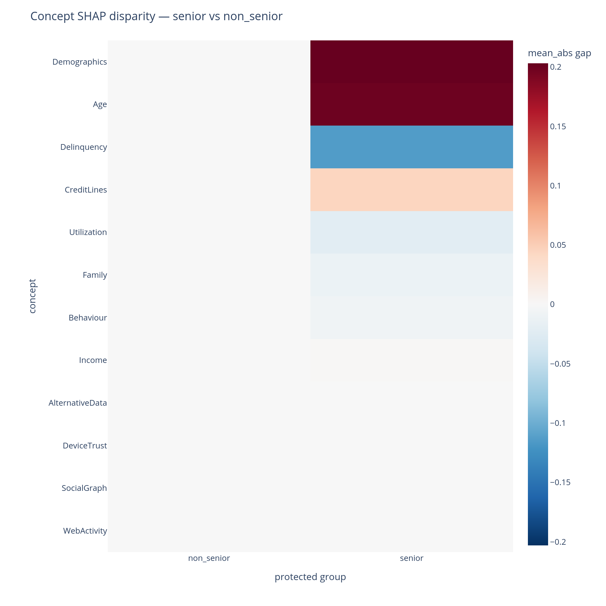

# Where does the model behave differently across protected groups?

Fairness review needs a chart that says, for each concept, how
differently the model treated group A vs. group B. Per-feature
disparity numbers are too granular for the conversation; the disparity
heatmap rolls them up to the concept level.

## When to use this

- Before any model launch where a protected attribute (sex, race,
  marital status, age category, …) is in scope of legal or regulatory
  fairness review.
- During incident response on a fairness complaint, to locate the
  *concept* the model treats differently across groups.
- As a periodic monitoring view: re-run on a recent slice and compare
  against the launch baseline.

## The view

| Function | Returns | Use for |
|---|---|---|
| [`concept_disparity`](../api.md#importance) + [`concept_disparity_heatmap`](../api.md#plotting) | Long-form (concept, group) → signed gap vs a reference group | "Which concepts does the model lean on more heavily for group A than for group B?" |

## Minimal example

```python
from concept_graph_xai import (
    concept_disparity, concept_disparity_heatmap,
)

# A protected-attribute column on X, or a separately built Series.
# Any number of groups is supported; every group is compared against
# the explicit reference group.
disp = concept_disparity(graph, feature_names, shap_values,
                         protected="senior_flag", reference="non_senior",
                         X=X)

concept_disparity_heatmap(graph, disp).show()
```

{ width="640" }

## Reading the output

Rows are concepts (by default sorted by the maximum `|gap|` across
groups). Columns are protected groups, each compared against the
`reference` group; the reference group's own column is exactly zero
and is kept as a visible baseline (`include_reference=False` drops
it). Cell colour encodes the **signed gap** (a diverging palette
centred at zero):

- A **red cell** means that group received a larger mean|SHAP|
  contribution from this concept than the reference group.
- A **blue cell** means the reverse.
- A **white cell** means the model contributed comparably from this
  concept across the two groups.

The magnitude is in the same units as `mean(|SHAP|)`. The default
`"RdBu_r"` colorscale is centred at zero so the colour scale is
comparable between cells.

## What to do with the answer

1. Investigate the largest-magnitude cells first. The disparity says
   *the model treats these groups differently in this concept* — the
   next question is **why**, which the cohort view, per-prediction
   waterfalls, and (often) an upstream-data audit can answer.
2. Distinguish *legitimate* vs *unjustified* disparities with legal /
   business / domain context. The heatmap surfaces; it does not
   adjudicate. A disparity in *Income* across age groups is usually
   legitimate; a disparity in *Demographics* may not be.
3. Pair with the [cohort](cohort.md) view on the same segments
   defined as protected groups. If the same concept lights up in both
   views, the model is consistently group-differential there; if only
   one view lights up, the difference may be a statistical artefact
   of cell sizes.
4. Carry the flagged concepts into the
   [tree-design review](concept-design.md): a kitchen-sink concept
   that also shows large disparity is the highest-priority concept to
   split.

## Common pitfalls

- **Tiny cells.** Groups with few rows produce mean|SHAP| estimates
  with high variance — the disparity will look large even when the
  underlying difference is sample noise. Inspect
  `X.groupby(protected_col).size()` before reading.
- **Direction confusion.** Every gap is `value_group -
  value_reference`. With `protected` values `{"senior", "non_senior"}`
  and `reference="non_senior"`, a red cell in the `senior` column
  means *more contribution for seniors*. Pick the reference
  deliberately — it defines the sign of every cell.
- **Multi-group width.** With many groups, the heatmap grows one
  column per group. For very many groups, slice the output to the
  groups that matter or recode the column to a binary `versus-rest`
  flag before calling.

## Related

- [`concept_disparity`](../api.md#importance),
  [`concept_disparity_heatmap`](../api.md#plotting) — API reference.
- [Cohort](cohort.md) — same plot shape, legitimate-business-segment
  framing.
- [Per-prediction](per-prediction.md) — single-row waterfalls to
  investigate a flagged concept on individual cases.
- [How it works, Part G](../how-it-works.md#part-g-where-does-the-model-behave-differently-across-protected-groups)
  — the same answers in narrative form.
