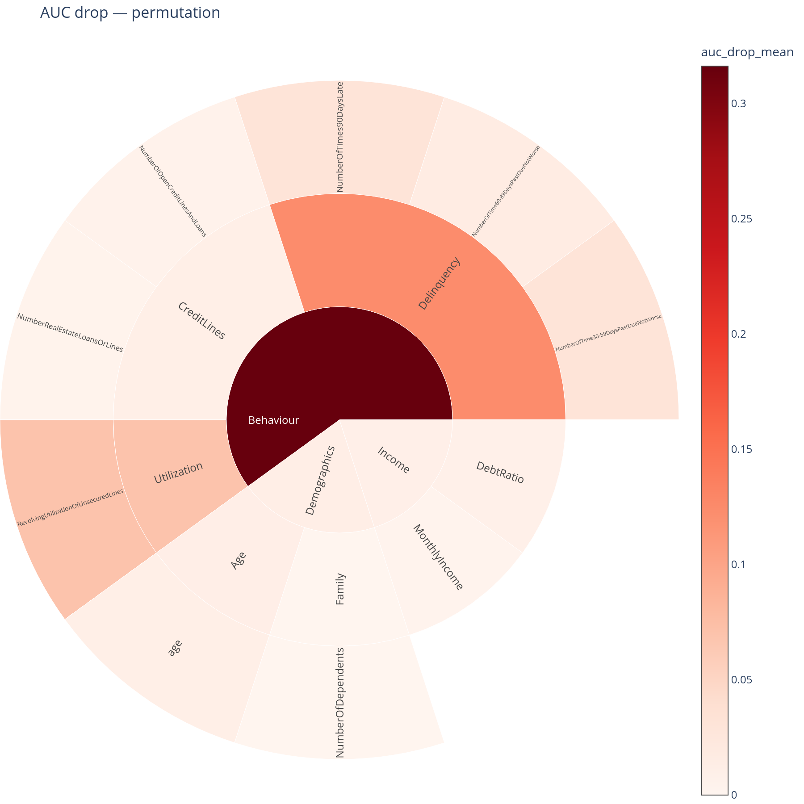
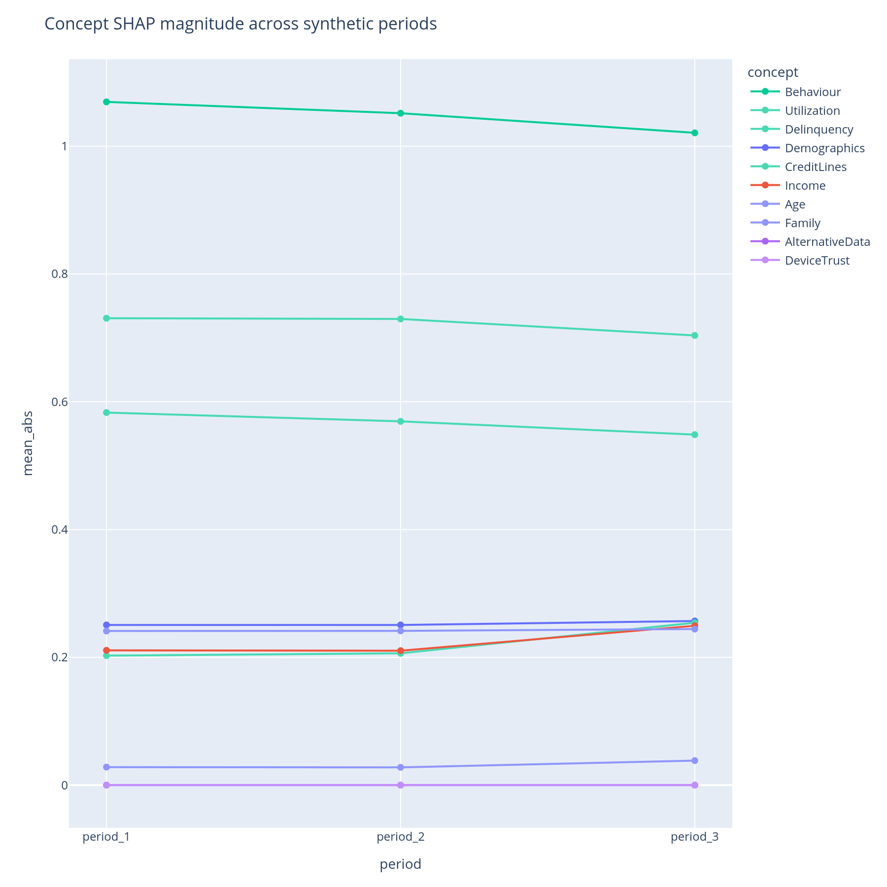
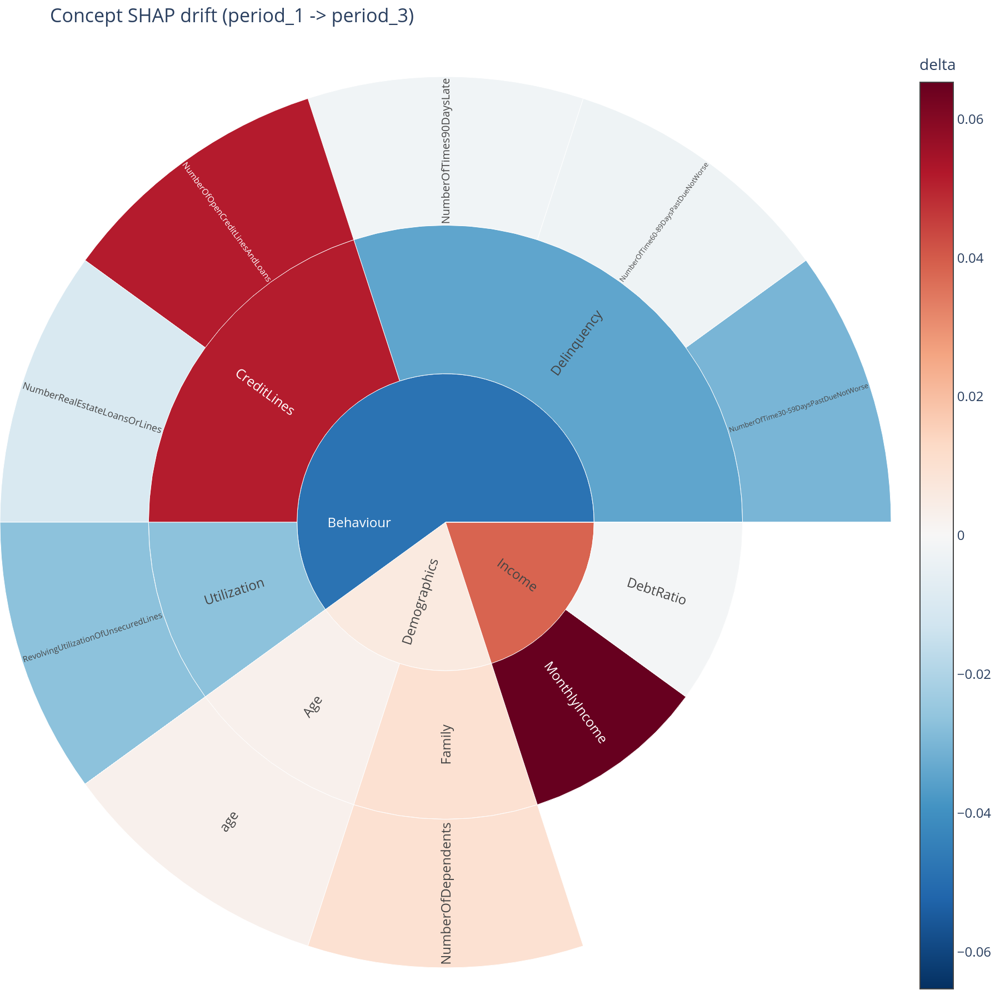

# Robustness and drift

Two failure modes that are not visible at training time but matter
the moment the model is in production: a whole concept's data going
missing (vendor outage, upstream feed cutoff, geography change), and
the concept-level contributions shifting across periods even when
overall metrics look stable.

## When to use this

- Before promoting a model to production, to write the
  operational-risk row "what if concept X goes missing?".
- After a vendor outage or feed change, to quantify what the model
  actually lost.
- Quarterly (or whenever the model is rescored on fresh data), to
  monitor concept-level drift before the global AUC tells you
  something is wrong.

## The two views

| Function | Returns | Use for |
|---|---|---|
| [`auc_drop`](../api.md#ablation) + [`auc_drop_map`](../api.md#plotting) | Per-concept AUC drop (or any metric drop) under ablation | "What does the model lose if concept X disappears?" |
| [`attribution_drift`](../api.md#drift) + [`concept_drift_lines`](../api.md#plotting) + [`concept_drift_sunburst`](../api.md#plotting) | Per-(period, concept) mean&#124;SHAP&#124;; line + delta-sunburst views | "Across periods, where is the concept-level drift?" |

## Ablation: three strategies

`auc_drop` answers *"how much performance do I lose if a whole
concept's data goes missing?"* with three different definitions of
"missing", trading off accuracy for cost.

### `permutation` (default)

For each concept, **shuffle** the values of its features across rows
and re-score on the held-out set, repeated `n_repeats` times.

- Cheap — no retraining.
- Model-agnostic — works for any model with `predict_proba` /
  `decision_function`.
- The model still *expects* the features to be there; it just sees
  decorrelated values. This is an upper bound on "what would happen
  if the data became uninformative", **not** "what would happen if
  the column was deleted".

```python
auc_drop(graph, model, X_test, y_test,
         feature_names=X_test.columns.tolist(),
         strategy="permutation",
         n_repeats=10, random_state=42)
```

Output columns: `auc_drop_mean`, `auc_drop_std` (across repeats),
`ablated_score_mean`, `baseline_score`, `feature_count`, `strategy`.

### `retrain`

For each concept, **drop** its features from the training set,
retrain, score on the held-out set with the same columns dropped.

- Most faithful to "this column will not exist in production".
- Most expensive: one retrain per concept.
- Requires a user-supplied `train_fn(X_train, y_train) ->
  fitted_estimator` callable so the package can rebuild the model
  exactly the way you want.

```python
def train_lgb(X, y):
    m = lgb.LGBMClassifier(n_estimators=200, random_state=42, verbose=-1)
    m.fit(X, y)
    return m

auc_drop(graph, model, X_test, y_test,
         feature_names=X_test.columns.tolist(),
         strategy="retrain",
         train_fn=train_lgb,
         X_train=X_train, y_train=y_train)
```

`auc_drop_std` is `NaN` (single retrain, no spread across repeats).

### `shap_marginal`

Cheapest. **Subtract** the concept's SHAP contributions from the
prediction logits, apply the link function, re-score.

- Almost free once you have SHAP values.
- An approximation under SHAP additivity. Treats each concept's
  contribution as independently subtractable, which is exact only for
  additive models.
- Useful as a sanity check or for fast iteration; not for regulatory
  submissions.

```python
auc_drop(graph, model, X_test, y_test,
         feature_names=X_test.columns.tolist(),
         strategy="shap_marginal",
         shap_values=shap_values,
         base_predictions=p_test)
```

### Picking a strategy

| Use case | Strategy |
|---|---|
| Quick iteration, "is this branch important?" | `permutation` |
| Sanity check, you already have SHAP values | `shap_marginal` |
| Regulatory submission, "what happens if Equifax goes down?" | `retrain` |
| Comparison study (run all three, look for disagreements) | All three with the same graph |

A common pattern: run `permutation` first to identify the top-k
concepts, then `retrain` only on those k.

### Custom scoring metrics

`auc_drop` accepts any sklearn-compatible scoring callable via the
`metric` argument.

```python
from sklearn.metrics import log_loss

auc_drop(..., metric="roc_auc")                  # built-in
auc_drop(..., metric=lambda y, p: -log_loss(y, p))  # any callable
```

The function name (`auc_drop`) is historical; the implementation is
metric-agnostic.

### What `skip_root` does

The root concept covers *every* feature; ablating it means "the model
gets pure noise / nothing", which by definition tanks the score.

`skip_root=True` (the default) leaves the root row in the DataFrame
with `auc_drop_mean = NaN` so it does not pollute the colour scale of
[`auc_drop_map`](../api.md#plotting). The structural columns
(`feature_count`, etc.) are still populated — required so the parent
sunburst sector is not smaller than its children.

### Realism — does this scenario actually happen?

`auc_drop` tells you *what would happen* if a concept went missing.
To answer *how often that actually happens*, pair with
[`joint_missing_rate`](../api.md#missingness) (covered in depth on the
[missing-values page](missing-values.md)):

```python
import pandas as pd

drop = auc_drop(graph, model, X_test, y_test,
                feature_names=X_test.columns.tolist(),
                strategy="permutation").reset_index()
jmr  = joint_missing_rate(graph, X_test).reset_index()

risk = (drop[["path", "auc_drop_mean"]]
        .merge(jmr[["path", "joint_missing_rate"]], on="path")
        .assign(realism_weighted=lambda d:
                d["auc_drop_mean"] * d["joint_missing_rate"]))
```

The package deliberately does **not** bake `realism_weighted` into
`auc_drop` (see decision **D2** in the
[roadmap decision log](../roadmap.md)) — different teams want
different fusion rules, and the join is one line.

{ width="560" }

## Drift across periods

`attribution_drift` aggregates SHAP per (period, concept) and returns
a long-form DataFrame the drift plots consume. Each period is one
`(label, shap_values, feature_names)` tuple — the labels can be
anything: calendar quarters, model versions, geographies, a
before/after-launch flag.

```python
from concept_graph_xai import (
    attribution_drift, concept_drift_delta, concept_drift_lines,
    concept_drift_sunburst,
)

# One tuple per period, in the order you want them plotted.
periods = [
    ("2024Q1", shap_q1, feature_names),
    ("2024Q2", shap_q2, feature_names),
    ("2024Q4", shap_q4, feature_names),
]

dr = attribution_drift(graph, periods)

# Line chart — "did each concept's contribution stay stable?"
concept_drift_lines(graph, dr, max_concepts=8).show()

# Delta sunburst — "where in the tree is the drift concentrated?"
delta = concept_drift_delta(graph, periods,
                            baseline="2024Q1", target="2024Q4")
concept_drift_sunburst(graph, delta).show()
```

{ width="720" }

{ width="520" }

### Reading the lines

One line per concept, x = period in the order you supplied, y = mean|SHAP| for
that concept in that period. Lines are sorted by max-across-periods
so the most prominent concepts list first; `max_concepts=` caps the
chart at the top-K to avoid spaghetti.

### Reading the delta sunburst

Sector area = the concept's total contribution. Colour = signed
change `target - baseline` (diverging palette). Red sectors got more
important; blue sectors got less. Pair with the line chart: the
sunburst answers *where*, the lines answer *how monotonically*.

### What to do with the answer

1. Define a **retraining trigger** in concept terms (e.g. *"retrain
   if any top-3 concept's mean|SHAP| moves by more than X across two
   consecutive quarters"*). This is what the drift sunburst is for.
2. Cross-reference drift with the disparity heatmap from
   [fairness](fairness.md): drift that lands in protected-group
   concepts is the most urgent kind.
3. Quote ablation numbers **weighted by joint-missing-rate** when
   pushing them into operational-risk; the raw AUC drop is a
   "what-if", the realism-weighted version is an "expected loss".

## Common pitfalls

- **Permutation can show positive AUC drops on noise.** If
  `auc_drop_mean` is negative for some concept, the permutation
  improved the score — which usually means the feature was injecting
  noise the model latched onto. Worth investigating, not a bug.
- **Retrain identity.** The retrain strategy will rebuild the model
  exactly as `train_fn` defines. If your training pipeline includes
  preprocessing (e.g. categorical encoders that learned categories
  from the training set), wrap that inside `train_fn` so the
  ablation actually reflects retraining-from-scratch.
- **Drift period order.** Periods are plotted in the order of the
  supplied list of `(label, shap_values, feature_names)` tuples —
  pass them chronologically, or the lines will mis-sort.

## Related

- [`auc_drop`](../api.md#ablation),
  [`attribution_drift`](../api.md#drift),
  [`concept_drift_lines`](../api.md#plotting),
  [`concept_drift_sunburst`](../api.md#plotting),
  [`joint_missing_rate`](../api.md#missingness) — API
  reference.
- [Missing values](missing-values.md) — the joint-missing-rate
  sunburst that calibrates the realism of the AUC-drop scenario.
- [Cohort](cohort.md) and [Fairness](fairness.md) — drift across
  segments or protected groups is often the right level at which to
  notice a problem.
- [How it works, Part H](../how-it-works.md#part-h-what-if-data-goes-missing-or-my-model-has-drifted)
  — the same answers in narrative form.
