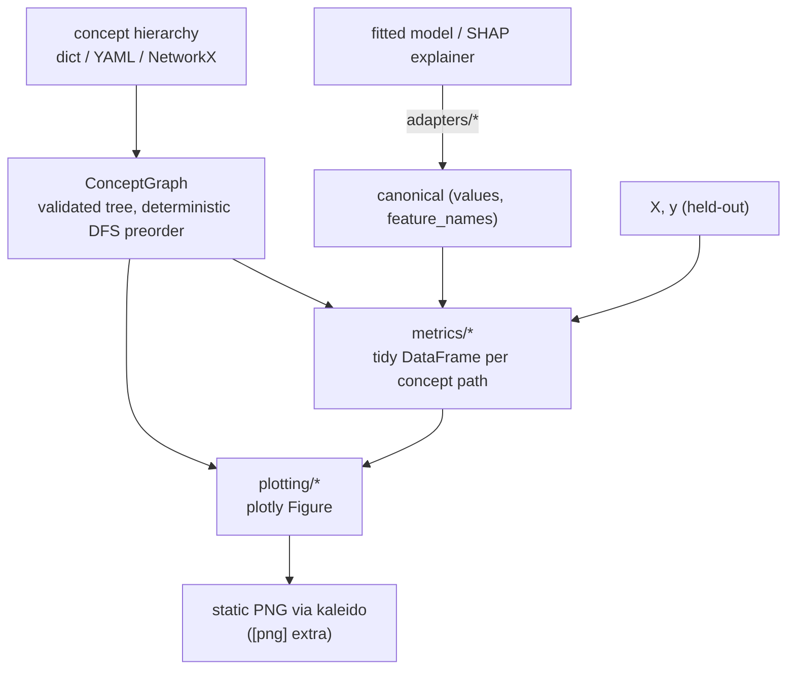

# How concept-graph-xai works

`concept-graph-xai`'s promise is that every per-feature interpretability signal your
stack already produces can be re-told at the level your committee actually argues:
business concepts. This article walks one realistic credit-risk scenario end to end —
the same scenario as the notebook
[`examples/01_credit_risk_walkthrough.ipynb`](https://github.com/wlazlod/concept-graph-xai/blob/main/examples/01_credit_risk_walkthrough.ipynb),
narrated as prose. Each section follows the same shape:

1. **The question** — what you are actually trying to learn.
2. **The chart** — what `concept-graph-xai` renders.
3. **Reading it** — what each colour, axis, sector means.
4. **What to do with the answer** — the action the chart is supposed to unlock.
5. **Code** — the minimum call to reproduce.

The notebook cell references (e.g. *B.1*) point to the matching section in the live
walkthrough so you can switch between prose and a running kernel.

!!! example "Running example"
    The dataset is Kaggle's "Give Me Some Credit" — 150k borrowers, the target is
    90-day-plus delinquency. The model is a default-tuned `LGBMClassifier`. The
    interpreter is `shap.TreeExplainer`. None of that is special to this library; you
    bring your own. What *is* special is the third object: a **concept graph**
    describing how the eleven input features roll up into business concepts.

The pipeline, end to end — the graph is built once, every metric consumes it together
with the per-feature values your interpreter produced, and every plot consumes a metric
DataFrame:



## Setup *(notebook part A)*

```python
from concept_graph_xai import ConceptGraph

graph = ConceptGraph.from_dict({
    "RiskProfile": {
        "Demographics": {"Age": ["age"], "Family": ["n_dependents"]},
        "Income": ["monthly_income", "debt_ratio"],
        "Behaviour": {
            "Delinquency": [
                "n_30_59_dpd", "n_60_89_dpd", "n_90_plus_dpd",
            ],
            "Utilization": ["revolving_utilization"],
        },
    }
})
```

The tree is small but already opinionated. `Behaviour > Delinquency` groups three
columns the lender thinks of as *one* signal at three time horizons. `Income` covers
two distinct features that the credit committee will discuss together.
`Demographics > Age` carries a PII flag that fairness review cares about.

Most of the library's functions take this `graph` plus the per-feature output your
interpreter already produced (`shap_values`, `feature_names`) and roll it up.

> Notebook cells: *A.1* (imports), *A.2* (data), *A.3* (graph), *A.4* (LightGBM
> training), *A.5* (SHAP).

---

## Part B — What does my model rely on?

The first question after training is always the same: which concepts move the
decision, and which ones are dead weight.

### B.1 Concept utilization

{ width="560" }

**The question.** Which branches of the concept tree did the model actually use? Which
ones are present in the schema but invisible at inference time?

**Reading it.** Saturated sectors are concepts whose aggregated importance clears the
`threshold`. Grey sectors are *defined* in the tree but the model effectively ignored
them — either because the underlying feature is constant in this data, or because the
tree expanded it once and pruned it. The root sector is hidden so that the top-level
branches occupy the centre ring.

**What to do with the answer.** Greyed-out concepts are a coverage question for the
data team (*is this feature actually populated?*) and a scope question for the model
team (*do we still need this column at all?*). Saturated sectors are the ones the next
sections will explain.

```python
from concept_graph_xai import utilization, utilization_map

util = utilization(graph, feature_names, shap_values, threshold=0.0)
utilization_map(graph, util).show()
```

> Notebook cell: *B.1*.

### B.2 Concept importance with bootstrap intervals

{ width="560" }

{ width="640" }

**The question.** Of the concepts the model uses, how much of the total mean|SHAP| does
each one carry — and is that point estimate trustworthy or is it sample noise?

**Reading the sunburst.** Each concept's sector area is its summed mean|SHAP|:

$$
\mathrm{importance}(c) \;=\; \sum_{f \,\in\, \mathrm{desc}(c)} \frac{1}{N} \sum_{n=1}^{N} \bigl|\, \phi_{n,f} \,\bigr|
$$

where $\phi_{n,f}$ is the SHAP value of feature $f$ on row $n$. Hover for the exact
value and the `feature_count` carried in that subtree. The colour follows the top-level
branch, lightened with depth, so a *Behaviour > Delinquency* leaf is a paler shade of
the same hue as its parent.

**Reading the bar chart.** The horizontal bars are bootstrap percentile confidence
intervals (1000 resamples here; the default is `n_bootstrap=200` at a 95% CI). A bar
that crosses the next-ranked concept's interval means the ordering is not statistically
separable on this sample — the committee should not insist on a "Behaviour is bigger
than Income" claim from the point estimate alone.

**What to do with the answer.** Lock the ordering you can defend. Promote concepts
with tight intervals to the executive summary; flag the ones with overlapping
intervals as "comparable" rather than "ranked".

```python
from concept_graph_xai import (
    bootstrap_importance, importance_sum, signed_concept_bar, sunburst,
)

sunburst(graph, importance_sum(graph, feature_names, shap_values),
         value="importance_sum").show()

boot = bootstrap_importance(graph, feature_names, shap_values,
                            n_bootstrap=1000, random_state=42)
signed_concept_bar(graph, boot).show()
```

> Notebook cell: *B.2*.

---

## Part C — How does the signal compose?

Part B told you *which* concepts matter. Part C asks *how they work together* — which
pairs interact, and how does each row's prediction flow through the tree.

### C.1 Concept × concept interaction matrix

{ width="560" }

**The question.** Does the model use concepts independently, or does *Income* and
*Behaviour* together carry a non-additive signal that neither carries alone?

**Reading it.** The matrix aggregates SHAP interaction values up the tree. Diagonal
cells are the within-concept self-interaction (a non-zero value means the concept's
features interact with each other); off-diagonal cells are between-concept
interactions. Both halves are rendered (the matrix is symmetric) so the visual is
unambiguous.

**What to do with the answer.** A large off-diagonal cell — *Income × Behaviour*, say
— means a univariate "what does Income contribute" answer is incomplete; the
contribution depends on the behavioural context. That belongs in the model report.

```python
from concept_graph_xai import (
    concept_interaction_heatmap, concept_interaction_matrix,
)

inter = concept_interaction_matrix(graph, feature_names,
                                   shap_interaction_values)
concept_interaction_heatmap(inter).show()
```

> Notebook cell: *C.1*. SHAP interaction values are expensive (`O(F²)`); compute them
> once and cache.

### C.2 Feature → concept → ±outcome Sankey

{ width="720" }

**The question.** For the average prediction, where does the signal *enter* the tree
(which feature contributes most), where does it *aggregate* (which mid-level concept
absorbs that contribution), and which direction does it push the outcome?

**Reading it.** Left: features. Middle: one tier per concept level, nested
top-to-bottom in DFS preorder so siblings sit together — for deep trees this produces
multiple intermediate tiers (`feature → sub-concept → top-level concept`). Right: the
±outcome bucket. Link width is summed magnitude; link colour inherits the source
feature's branch hue. Each top-level concept splits its flow between `+outcome` and
`-outcome`: rows where its summed contribution pushes the prediction *up* feed the `+`
band, rows where it pushes *down* feed the `-` band.

**What to do with the answer.** This is the chart for the model narrative — the one
slide that shows a non-technical audience how the signal physically moves from raw
column to decision.

```python
from concept_graph_xai import concept_sankey

concept_sankey(graph, feature_names, shap_values).show()
```

> Notebook cell: *C.2*.

---

## Part D — Why this prediction?

Parts B-C describe the model's average behaviour. Adjudication and adverse-action
notices need single-row explanations.

### D.1 Concept violin

{ width="640" }

**The question.** For each concept, what is the *distribution* of its contribution
across all predictions — is it usually a small nudge or occasionally a large one?

**Reading it.** Each violin shows the per-sample concept-level SHAP (summed over
descendant features) for one concept. Width at a given y-value is the density of rows
with that contribution. Long thin tails mean the concept is normally quiet but
occasionally swings the prediction by a lot.

**What to do with the answer.** Concepts with long tails are the ones to inspect at
the row level — typical adjudication cases happen in the tail. Concepts with tight
central mass are background contributors and rarely surface in single-row
explanations.

```python
from concept_graph_xai import concept_violin

concept_violin(graph, feature_names, shap_values).show()
```

> Notebook cell: *D.1*.

### D.2 Concept waterfall

{ width="640" }

**The question.** For *this specific prediction*, which concepts pushed it up, which
pushed it down, and what was the net?

**Reading it.** A standard SHAP waterfall, except the bars are concepts rather than
only features. Top: model base value. Each bar adds or subtracts the concept's
row-level contribution (green = pushes the prediction up, red = pushes it down).
Bottom: the model's predicted logit for this row. The `depth` parameter controls how
deep into the tree to roll up; `depth=1` keeps the explanation at the level
Income/Behaviour, `depth=2` descends to Delinquency vs Utilization.

**What to do with the answer.** This is the chart the adjudicator sees. The reviewer
answers "the model declined this loan because *Behaviour > Delinquency* was the
dominant push, with *Income* partially offsetting" — a sentence the regulator's
expected formulation.

```python
from concept_graph_xai import ConceptPredictionExplainer

explainer = ConceptPredictionExplainer(graph, model, X, shap_values,
                                       base_value=expected_value)
explainer.waterfall(highest_risk_idx, depth=1).show()
explainer.waterfall(highest_risk_idx, depth=2).show()
```

> Notebook cells: *D.2a* (highest), *D.2b* (lowest), *D.2c* (depth-2 roll-up).

---

## Part E — Is my concept tree any good?

Parts B-D assumed the tree was sensible. This section interrogates the tree itself
before the review meeting where someone else will.

### E.1 Block-structured feature correlation

{ width="640" }

**The question.** Are features inside a concept correlated with each other
(within-concept coherence)? Are concept boundaries leaky (off-diagonal correlation
across siblings)?

**Reading it.** A Spearman correlation matrix, but features are ordered along the
graph's DFS preorder so every concept forms a *contiguous block*. Each diagonal block
is annotated with its within-block mean|ρ|. Black separator lines bound the top-level
concepts.

**What to do with the answer.** A diagonal block that is uniformly white means "these
features are not really related" — the concept may be a kitchen-sink grouping. A high
off-diagonal block between two sibling concepts means "the boundary is in the wrong
place" — that pair of concepts probably wants to be merged or re-cut.

```python
from concept_graph_xai import correlation_block, feature_correlation

fc = feature_correlation(graph, X, method="spearman")
correlation_block(fc, title="Feature correlation").show()
```

> Notebook cell: *E.1*. The same `correlation_block` plot is reused for nullity
> (*E.2*) and SHAP (*E.5*) — different input, same shape.

### E.2 + E.3 Whole-branch missingness

{ width="560" }

**The question.** If a concept's data went missing in production (upstream feed
outage, vendor cutoff), would it tend to go missing as a *whole block*, or just one
feature at a time?

**Reading it.** The sunburst sizes each sector by the fraction of rows where *every*
descendant feature was simultaneously null. A large sector means whole-branch outages
are realistic; a small sector means single-feature outages dominate.

**What to do with the answer.** This calibrates how seriously to take the ablation
results in Part H. If joint-missing-rate is near zero, the "concept goes missing"
simulation is pessimistic — the real operational risk is per-feature gaps. If
joint-missing-rate is high, the simulation reflects reality and the AUC-drop numbers
belong in the operational-risk register.

```python
from concept_graph_xai import joint_missing_map, joint_missing_rate

joint_missing_map(graph, joint_missing_rate(graph, X)).show()
```

> Notebook cells: *E.2* (nullity correlation block), *E.3* (joint missing-rate
> sunburst).

### E.4 Concept-coherence vs concept-importance scatter

{ width="640" }

**The question.** Is each concept *both* coherent (its features cluster together in
the data) *and* important (the model leans on it)?

**Reading it.** One point per concept. X = within-concept mean(|ρ|); Y = summed
|SHAP|. Dashed lines at the medians cut the plane into four quadrants:

| Quadrant | Read | Action |
|---|---|---|
| Top-right (high coherence, high importance) | "Well-designed" | Keep. Document. |
| Top-left (low coherence, high importance) | "Kitchen sink" | Split. The model relies on this concept but the concept itself is heterogeneous. |
| Bottom-right (high coherence, low importance) | "Redundant" | Merge or drop. Coherent but unused. |
| Bottom-left (low coherence, low importance) | "Noise" | Drop. Adds bookkeeping cost without explanatory value. |

**What to do with the answer.** This is the slide for the tree-design review. A
concept in the kitchen-sink quadrant is the most important kind of finding — the model
*needs* this signal, but the way the signal has been *named* is misleading.

```python
from concept_graph_xai import (
    coherence_importance, coherence_importance_scatter,
)

coh = coherence_importance(graph, X, feature_names, shap_values)
coherence_importance_scatter(coh).show()
```

> Notebook cell: *E.4*. The thresholds default to the medians across concepts; pass
> `coherence_threshold=` / `importance_threshold=` for absolute cutoffs.

### E.5 + E.6 SHAP correlation and the regulatory overlay

*E.5* (SHAP correlation block, same plot as E.1 but on `shap_values` instead of `X`)
answers a different question: *does the model treat two features as substitutes
regardless of how correlated they are in the data?* Two raw-uncorrelated features can
be SHAP-redundant; two raw-correlated features can be SHAP-different. Disagreement
between *E.1* and *E.5* is informative.

*E.6* (regulatory tag overlay) is a single sunburst whose sectors are coloured by
`metadata["tag"]` on each node — PII vs. financial vs. behavioural vs.
bureau-supplied. The chart visually answers "what fraction of the model's importance
flows through PII?" in one glance.

```python
from concept_graph_xai import (
    correlation_block, importance_sum, regulatory_tag_overlay, shap_correlation,
)

sc = shap_correlation(graph, feature_names, shap_values)
correlation_block(sc, title="SHAP correlation").show()

imp = importance_sum(graph, feature_names, shap_values)
regulatory_tag_overlay(graph, imp, value="importance_sum", tag_key="tag").show()
```

> Notebook cells: *E.5*, *E.6*.

---

## Part F — Does importance differ across cohorts?

The model has one global behaviour described in Part B. Operationally, it has
*several* behaviours — one per segment.

### F.1 Segment × concept heatmap

{ width="640" }

**The question.** For each (segment, concept) pair, what is the mean|SHAP|
contribution of that concept in that segment?

**Reading it.** Rows are concepts (DFS preorder), columns are segments (e.g. age
buckets, geography, channel), colour is mean|SHAP|. A row that is uniformly red means
"this concept always matters"; a row with a single dark column means "this concept
matters *only* for that segment". Hover shows the per-cell value and the
`feature_count` of the concept.

**What to do with the answer.** A concept that matters in one segment and not others
is a place to look for a segment-specific failure mode — a missing-data pattern, a
label-shift, a sub-population the training data under-represented.

```python
from concept_graph_xai import (
    segment_concept_heatmap, segment_importance,
)

seg = segment_importance(graph, feature_names, shap_values,
                         segments="age_bucket", X=X)
segment_concept_heatmap(graph, seg).show()
```

> Notebook cell: *F.1*. `segments=` accepts either a pandas Series aligned to
> `shap_values` rows or a column-name string referencing `X`.

### F.2 Concept-importance Pareto per cohort

{ width="640" }

**The question.** Within each cohort, do a few concepts carry most of the explanation
(steep Pareto) or is the importance spread across many (flat Pareto)?

**Reading it.** One curve per cohort. X = concept rank within cohort. Y = cumulative
share of that cohort's total |SHAP|. A steep curve means the model is *concentrated*
on a few concepts for that cohort; a flat curve means it spreads its attention.

**What to do with the answer.** Concentration is fragility: a model that depends on
three concepts for the senior cohort is more brittle to those three concepts shifting
than a model that depends on ten. This becomes the "diversification" axis of the
operational-risk view.

```python
from concept_graph_xai import concept_pareto

concept_pareto(graph, seg).show()
```

> Notebook cell: *F.2*.

---

## Part G — Where does the model behave differently across protected groups?

Fairness review needs a chart that says, for each concept, how differently the model
treated group A vs. group B.

### G.1 Concept disparity heatmap

{ width="640" }

**The question.** For each (concept, protected-group) pair, what is the disparity in
mean|SHAP| against a reference group? Where in the tree does the model treat seniors
differently from non-seniors?

**Reading it.** Rows are concepts; columns are protected groups, each compared against
the explicit `reference` group (whose own column is exactly zero, kept as a visible
baseline). Cell colour encodes the signed gap (diverging palette around zero). A red
cell means that group received a larger mean|SHAP| contribution from that concept than
the reference; a blue cell is the reverse.

**What to do with the answer.** Large-magnitude cells flag *concepts in which the
model behaves differently across groups*. Whether that difference is a fairness issue
depends on the legal framing — for some attributes any disparity is reportable; for
others, only disparities that cannot be justified by an upstream business necessity.
Either way, this is the chart for the conversation.

```python
from concept_graph_xai import (
    concept_disparity, concept_disparity_heatmap,
)

disp = concept_disparity(graph, feature_names, shap_values,
                         protected="senior_flag", reference="non_senior",
                         X=X)
concept_disparity_heatmap(graph, disp).show()
```

> Notebook cell: *G.1*.

---

## Part H — What if data goes missing, or my model has drifted?

Two failure modes that are not visible at training time.

### H.1 AUC drop under whole-branch ablation

{ width="560" }

**The question.** If a whole concept's data went missing in production, how much AUC
would the model lose?

**Reading it.** A sunburst where each sector's size is its AUC drop (mean of ten
permutation repeats by default). A large sector is a concept the model *cannot afford
to lose*. The root sector is suppressed: ablating the root means "the model gets pure
noise" and trivially tanks the score, which would dominate the colour scale.

**What to do with the answer.** Cross-reference with the joint-missing-rate sunburst
from *E.3*. A concept that is both high-AUC-drop *and* high-joint-missing-rate is a
real operational risk and belongs in the runbook. A concept that is high-AUC-drop but
low-joint-missing-rate is a *theoretical* risk worth watching but not necessarily
worth mitigating.

```python
from concept_graph_xai import auc_drop, auc_drop_map

drop = auc_drop(graph, model, X_test, y_test,
                feature_names=X_test.columns.tolist(),
                strategy="permutation", n_repeats=10, random_state=42)
auc_drop_map(graph, drop).show()
```

> Notebook cell: *H.1*. Three strategies are available — `permutation` (cheap,
> model-agnostic, the default), `retrain` (most faithful, most expensive),
> `shap_marginal` (approximation, almost free). See the
> [robustness page](concepts/robustness.md) for the trade-offs.

### H.2 + H.3 Drift across periods

{ width="720" }

{ width="560" }

**The question.** Across two or more time periods (or model versions, or
geographies), is each concept's contribution stable? Where is the drift concentrated?

**Reading the lines.** One line per concept, x = period in the order you supplied,
y = `mean|SHAP|` for that concept in that period. Lines are sorted by
max-across-periods so the most prominent concepts list first; an optional
`max_concepts=` cap keeps the chart legible.

**Reading the sunburst.** A delta view: baseline period vs. target period. Sector
area = concept's total contribution; colour = *direction and magnitude of change*
(diverging palette). Red sectors got more important; blue sectors got less.

**What to do with the answer.** Lines tell you *whether* drift happened. The sunburst
tells you *where* in the tree the drift is — which is the right format for retraining
decisions ("we will retrain when *Behaviour > Delinquency* moves by more than X
mean|SHAP|").

```python
from concept_graph_xai import (
    attribution_drift, concept_drift_delta, concept_drift_lines,
    concept_drift_sunburst,
)

# One (label, shap_values, feature_names) tuple per period, in order.
periods = [
    ("2024Q1", shap_q1, feature_names),
    ("2024Q4", shap_q4, feature_names),
]

dr = attribution_drift(graph, periods)
concept_drift_lines(graph, dr, max_concepts=8).show()

delta = concept_drift_delta(graph, periods,
                            baseline="2024Q1", target="2024Q4")
concept_drift_sunburst(graph, delta).show()
```

> Notebook cells: *H.2* (lines), *H.3* (sunburst).

---

## Part I — Export

Every plot returns a `plotly.graph_objects.Figure`, so static-PNG export is a
one-liner via `kaleido`:

```python
fig.write_image("importance.png", scale=2)
```

The notebook's *Part I* dumps the full set into `examples/out/`, which is what
produced every image on this page.

---

## Where to go next

- **Pick a question** to dig into from the Concepts section — each page is one of the
  workflow questions above, with the API in full and the common pitfalls flagged:
    - [What does my model rely on?](concepts/structure.md)
    - [How does the signal compose?](concepts/composition.md)
    - [Why this prediction?](concepts/per-prediction.md)
    - [Is my concept tree any good?](concepts/concept-design.md)
    - [Does importance differ across cohorts?](concepts/cohort.md)
    - [Where does the model behave differently across protected groups?](concepts/fairness.md)
    - [What if data goes missing or drifts?](concepts/robustness.md)
- **Bring your own graph** following the
  [concept graphs](concepts/concept-graphs.md) reference.
- [API reference](api.md).
