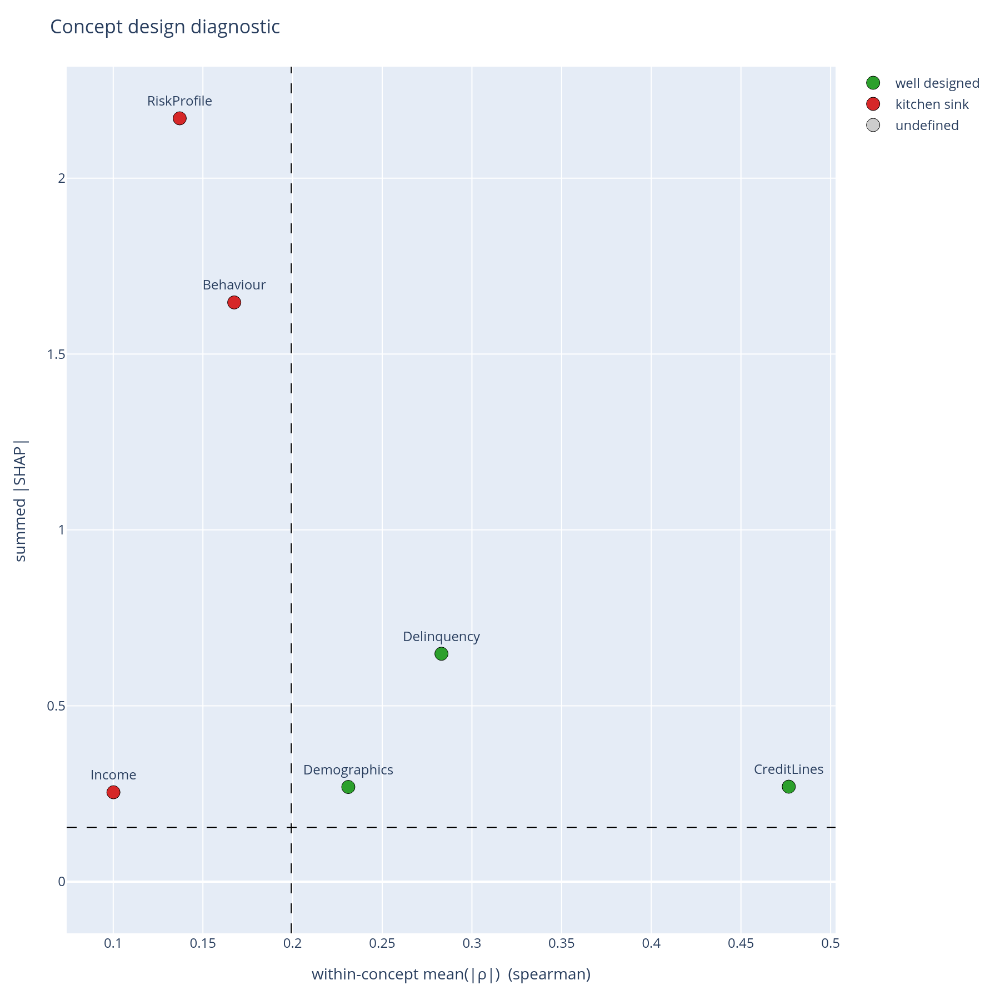

# concept-graph-xai

**SHAP, told the way your model committee actually argues.**

`concept-graph-xai` answers: *which concept did the model lean on, and was that concept
the right thing to lean on at all?* You bring the business-concept hierarchy; the
library reshapes every per-feature interpretability signal — importance, utilization,
interactions, ablations, drift, per-group fairness — through it.

!!! warning "Alpha"
    v0.6.1 is an alpha release; the API may change between minor releases. The metric
    layer (`metrics/*`) and plot layer (`plotting/*`) are stable and independently
    testable; v1.0 will add DAG support with optional per-edge weights
    ([roadmap](roadmap.md)).

```python
from concept_graph_xai import ConceptGraph, importance_sum, sunburst
from concept_graph_xai.adapters import from_feature_importances_

graph = ConceptGraph.from_dict({
    "Risk": {
        "Demographics": ["age"],
        "Income":       ["monthly_income", "debt_ratio"],
        "Behaviour":    ["n_30_dpd"],
    },
})

importances, feature_names = from_feature_importances_(model, X.columns.tolist())
imp = importance_sum(graph, feature_names, importances)
sunburst(graph, imp, value="importance_sum", title="Concept importance").show()
```

## The gap

A SHAP plot tells you which **features** moved a prediction. A model risk committee, a
fairness review, or a regulator asks something different: *which concept did the model
lean on, and was that concept the right thing to lean on at all?*

`monthly_income`, `debt_ratio`, and `revolving_utilization` are not three independent
levers — they are three windows onto **Income + Utilization**. `n_30_59_dpd`,
`n_60_89_dpd`, `n_90_plus_dpd` are not three independent features — they are one
**Delinquency** signal at three time horizons. The hierarchy that matters is the one
your business, your ontology, and your regulator argue in. SHAP does not know about
that hierarchy. Auto-clustering tools (`shap.utils.hclust`, `seaborn.clustermap`) infer
a different hierarchy from the data — one that maximises correlation, not one that
mirrors *PII vs. financial vs. behavioural vs. bureau-supplied*.

That is the gap. You already have the hierarchy on a whiteboard, in a regulatory
submission, in a feature-store taxonomy. `concept-graph-xai` takes that hierarchy as
input and rolls every per-feature signal up through it.

{ width="640" }

The single chart that no per-feature SHAP plot can produce: every concept in your tree
placed on *how coherent its features are* against *how much the model leans on it*. The
top-left quadrant is the danger zone — concepts the model relies on heavily but whose
features look like three different things. Those are the concepts to split before the
next review meeting.

## Highlights

- **Structure** — which concepts the model uses and how much each carries:
  utilization and importance sunbursts, plus bootstrap confidence intervals on the
  ranking ([structure and importance](concepts/structure.md)).
- **Composition** — concept × concept SHAP-interaction matrix and a
  feature → concept → ±outcome Sankey
  ([composition](concepts/composition.md)).
- **Per-prediction** — concept violins and single-row concept waterfalls for
  adjudication and adverse-action notices
  ([per-prediction explanations](concepts/per-prediction.md)).
- **Concept-design diagnostics** — block-structured correlation matrices and the
  coherence-vs-importance quadrant scatter that says whether the tree itself is
  defensible ([concept design](concepts/concept-design.md)).
- **Cohort and fairness views** — segment × concept heatmaps, per-cohort Pareto
  curves, and a concept disparity heatmap against a reference protected group
  ([cohorts](concepts/cohort.md), [fairness](concepts/fairness.md)).
- **Robustness** — AUC drop under whole-branch ablation (three strategies) and
  concept-level drift across periods
  ([robustness and drift](concepts/robustness.md)).
- **Strict layering** — metrics return plain `pandas.DataFrame`s and never import
  plotly; plots take a `ConceptGraph` plus a DataFrame and return
  `plotly.graph_objects.Figure`s, exportable to PNG via `kaleido`
  ([concept graphs](concepts/concept-graphs.md)).

## Where to start

1. [Getting started](getting-started.md) — install and your first sunburst in under a
   minute.
2. [How it works](how-it-works.md) — one realistic credit-risk scenario end-to-end,
   from training a model to defending its concept structure.
3. [Credit-risk walkthrough](notebooks/01_credit_risk_walkthrough.ipynb) — the same
   scenario as a runnable notebook, executed end-to-end on the Give Me Some Credit
   dataset.
4. [Concepts](concepts/concept-graphs.md) — the data model, then one page per workflow
   question.

## Project

[Roadmap](roadmap.md) ·
[Changelog](https://github.com/wlazlod/concept-graph-xai/blob/main/CHANGELOG.md)
