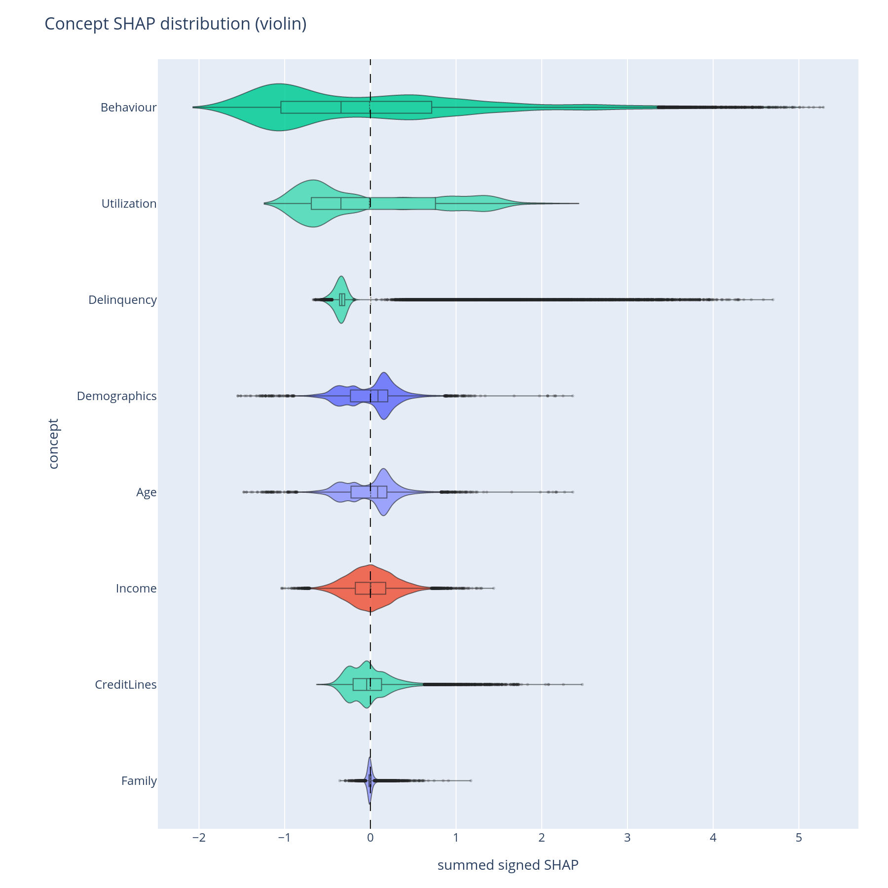
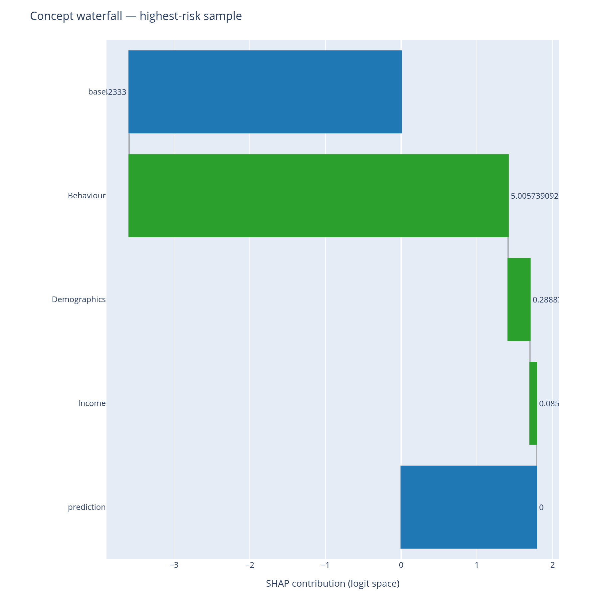

# Why this prediction?

Adjudication, adverse-action notices, and individual-case audits all
need explanations for *one specific row*, not the population average.
This page covers the two per-prediction plots.

## When to use this

- When an adjudicator opens a case file and needs a single-page
  explanation of why the model scored *this* loan, this patient, this
  transaction.
- When writing the legal-required adverse-action notice that has to
  cite the top reasons for a decline.
- When stress-testing the model on the highest- and lowest-risk
  predictions to make sure the explanation reads sensibly at the
  extremes.

## The two views

| Function | Returns | Use for |
|---|---|---|
| [`concept_violin`](../api/plotting.md) | Per-concept distribution of row-level SHAP | "How concentrated vs. spread is each concept's contribution?" |
| [`ConceptPredictionExplainer.waterfall`](../api/plotting.md) | Single-row contribution cascade | "Why this specific prediction?" |

`concept_violin` is a population-level summary that prepares you to
read individual rows. `waterfall` is the actual single-row chart.

## Minimal example

```python
from concept_graph_xai import (
    ConceptPredictionExplainer, concept_violin,
)

# Population-level distribution
concept_violin(graph, feature_names, shap_values).show()

# Single-row explanation
explainer = ConceptPredictionExplainer(graph, feature_names,
                                       shap_values,
                                       base_value=expected_value)

# Full-depth waterfall for the highest-risk row
highest_risk_idx = predictions.argmax()
explainer.waterfall(row_idx=highest_risk_idx).show()

# Same row, but capped at depth=2 (the C-suite version)
explainer.waterfall(row_idx=highest_risk_idx, depth=2).show()

# Drill into one branch
explainer.waterfall(row_idx=highest_risk_idx,
                    sub_tree="Behaviour").show()
```

{ width="640" }

{ width="640" }

## Reading the output

### Violin

Each violin is one concept; width at a given y-value is the density
of rows with that concept-level SHAP contribution. A long thin tail
means the concept is normally quiet but occasionally swings the
prediction by a lot. A tight cluster around zero means the concept
rarely matters at the row level even if its
[importance_sum](../api/metrics-importance.md) is non-zero.

Reading order matters: concepts are sorted by mean|SHAP|
(highest first) so the top violin is the dominant population-level
contributor.

### Waterfall

The classic SHAP waterfall, lifted to the concept level:

- **Top bar** = the model's base value (the expected log-odds before
  any feature is observed).
- **Each bar** = one concept's (or feature's) row-level signed
  contribution.
- **Bottom bar** = the model's prediction for this row.

`depth=None` (the default) expands the full tree. `depth=2` stops at
the second level — useful when the adjudication audience cares about
*Income vs Behaviour* but not *Behaviour > Delinquency vs Behaviour >
Utilization*. `sub_tree="X"` shows only the cascade under concept `X`
and is the right call for "explain why Behaviour was the dominant
driver".

The colour convention is the SHAP standard (red = pushes prediction
up, blue = pushes down) so the chart drops into any document already
using SHAP figures.

## What to do with the answer

1. Use `depth=2` waterfalls in the adjudication packet — they read
   naturally as a one-paragraph English sentence: *"the model
   declined this loan because Behaviour was the dominant push, with
   Income partially offsetting"*.
2. Use full-depth waterfalls for the regulatory case file where the
   underlying features must be cited.
3. Use `sub_tree=` when the reviewer asks a follow-up: *"why was
   Behaviour so dominant?"*.
4. Validate the chart on the extreme rows first
   (`predictions.argmax()`, `predictions.argmin()`) — if the
   explanation reads oddly at the extremes, the tree is probably
   mis-shaped and the [concept-design](concept-design.md) diagnostics
   will say where.

## Common pitfalls

- **`base_value` matters.** Pass the same `expected_value` that your
  SHAP explainer returned (e.g. `explainer.expected_value`). The
  waterfall is meaningless without it because the base + sum-of-bars
  identity is what makes SHAP additive.
- **Row index vs row position.** `row_idx` is the *positional* index
  into `shap_values`, not a pandas label. If `X` has a non-default
  index, use `X.index.get_loc(label)` to convert.
- **Categorical features.** If your model trained on one-hot
  encodings, each level appears as a separate feature in the
  waterfall. Group them in the concept tree by giving the category as
  a concept and the levels as its features — the waterfall will then
  collapse them at the concept level.

## Related

- [Composition](composition.md) — the population-level Sankey from
  which the row-level waterfall is the per-row slice.
- [Cohort](cohort.md) — when an explanation looks unusual, the cohort
  view often reveals it as a segment-specific behaviour rather than a
  bug.
- [Tour, Part D](../tour.md#part-d-why-this-prediction) — the same
  answers in narrative form.
