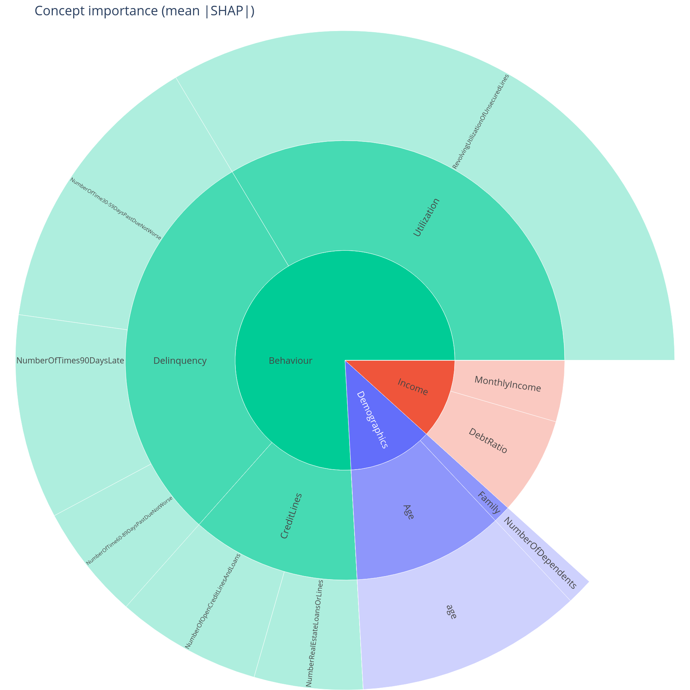
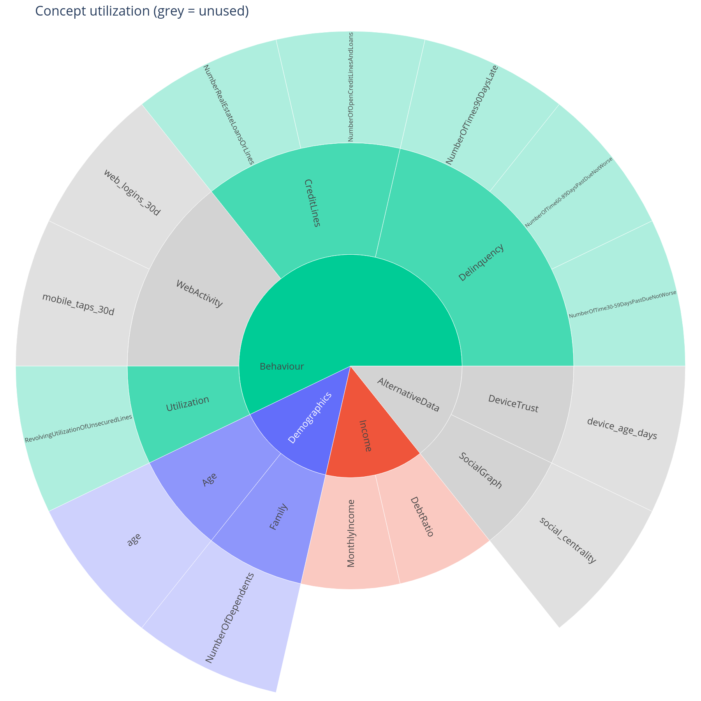
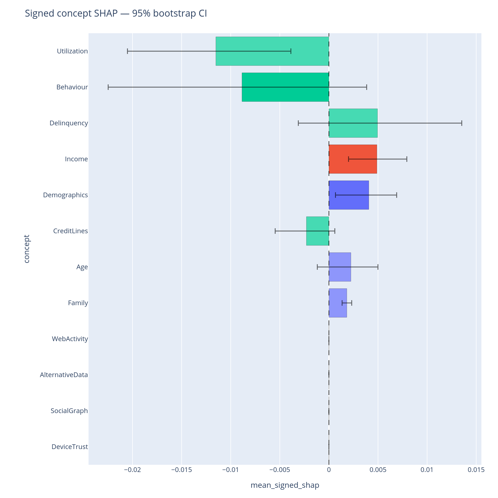

# What does my model rely on?

The first question after training a model is the same every time:
*which concepts does the model lean on, and which ones is it
ignoring?* This page covers the three metrics and three plots that
answer it, plus the bootstrap that tells you whether the ranking is
actually trustworthy on your sample size.

## When to use this

- After every retraining, to sanity-check that the model's importance
  story matches the team's mental model.
- Before any cohort / fairness / drift analysis — those questions only
  make sense for concepts the model actually uses.
- When writing the model report's "what does the model depend on"
  section.

## The three building blocks

| Function | Returns | Use for |
|---|---|---|
| [`feature_counts`](../api/metrics-counts.md) | Per-node feature count (model-free) | Sizing the structural backbone. |
| [`utilization`](../api/metrics-utilization.md) | Per-concept `is_used` flag + importance | Greying out the parts of the tree the model ignores. |
| [`importance_sum`](../api/metrics-importance.md) | Per-concept summed mean&#124;SHAP&#124; | Ranking the concepts the model uses. |

All three return a `pandas.DataFrame` indexed by the concept's
`/`-joined path. They join trivially on `path` for composite views.

## Minimal example

```python
from concept_graph_xai import (
    bootstrap_importance, bootstrap_importance_bar,
    importance_sum, sunburst, utilization, utilization_map,
)

# 1. Which parts does the model actually use?
util = utilization(graph, feature_names, shap_values, threshold=0.0)
utilization_map(graph, util).show()

# 2. Of the used parts, how much does each one carry?
imp = importance_sum(graph, feature_names, shap_values)
sunburst(graph, imp, value="importance_sum").show()

# 3. Is that ranking statistically separable on this sample size?
boot = bootstrap_importance(graph, feature_names, shap_values,
                            n_boot=1000, ci=0.95, random_state=42)
bootstrap_importance_bar(boot).show()
```

{ width="520" }

{ width="520" }

{ width="640" }

## Reading the output

### Utilization map

Saturated sectors are concepts whose descendant features hit at least
one `|SHAP|` value above `threshold`. Grey sectors are *defined* in
the tree but invisible at inference time. The root is hidden so the
top-level branches form the centre ring (the
[`sunburst_layout`](../api/plotting.md) helper handles the re-parenting
when `hide_root=True`, the default).

Common causes of an unexpectedly grey sector:

- The underlying feature is constant in this data slice.
- The model assigned negligible weight (tree-based importance has long
  tails — raising `threshold` to e.g. `0.01` makes "barely used"
  visible as grey).
- The feature name in the graph does not exactly match the column in
  `feature_names`. Run `align_features(graph, feature_names,
  on_unknown="raise")` to catch this.

### Importance sunburst

Each sector's area is `sum_{f in concept.descendants} mean_n(|SHAP[n,
f]|)`. Hover shows the exact value and the `feature_count` carried in
that subtree. Colour follows the top-level branch and is progressively
lightened with depth (see
[`branch_colors`](../api/plotting.md)) so a *Behaviour > Delinquency*
leaf is a paler shade of the same hue as its parent.

### Bootstrap bar

Horizontal bars are bootstrap percentile confidence intervals (default
`n_boot=1000`, `ci=0.95`). A bar that overlaps the next-ranked
concept's interval means the ranking is **not** statistically
separable at this sample size. Quote "comparable", not "ranked", in
the report.

## What to do with the answer

1. Promote concepts with tight, non-overlapping intervals to the
   executive summary.
2. Flag overlapping intervals as "comparable" rather than ranked.
3. Open a coverage ticket for any grey sector that *should* have been
   used (data-engineering question, not a model question).
4. Carry the importance-ranked list into the next workflow steps
   ([composition](composition.md), [cohort](cohort.md),
   [fairness](fairness.md), [robustness](robustness.md)).

## Common pitfalls

- **Mismatched feature names.** Default behaviour on unknown
  feature names is `on_unknown="warn"`. Switch to `"raise"` while
  developing, `"ignore"` only when you understand the omissions.
- **Signed vs absolute.** `importance_sum` aggregates `mean(|SHAP|)`
  by default. Pass `signed=True` if you want net direction (positive
  vs negative contribution) — keep in mind that signed values can
  cancel inside a concept, making it look unimportant when it is in
  fact strongly bidirectional.
- **Bootstrap cost.** `n_boot=1000` is the default. For
  > 10k rows × 200 features, 1000 resamples can run for minutes —
  start at `n_boot=200` during exploration and bump up before the
  final report.

## Related

- [`feature_counts`](../api/metrics-counts.md),
  [`importance_sum`](../api/metrics-importance.md),
  [`utilization`](../api/metrics-utilization.md),
  [`bootstrap_importance`](../api/metrics-importance.md) — API
  reference.
- [Composition](composition.md) — once you know which concepts matter,
  how do they combine?
- [Cohort](cohort.md) — does this ranking change across segments?
- [Tour, Part B](../tour.md#part-b-what-does-my-model-rely-on) — the
  same answers in narrative form.
